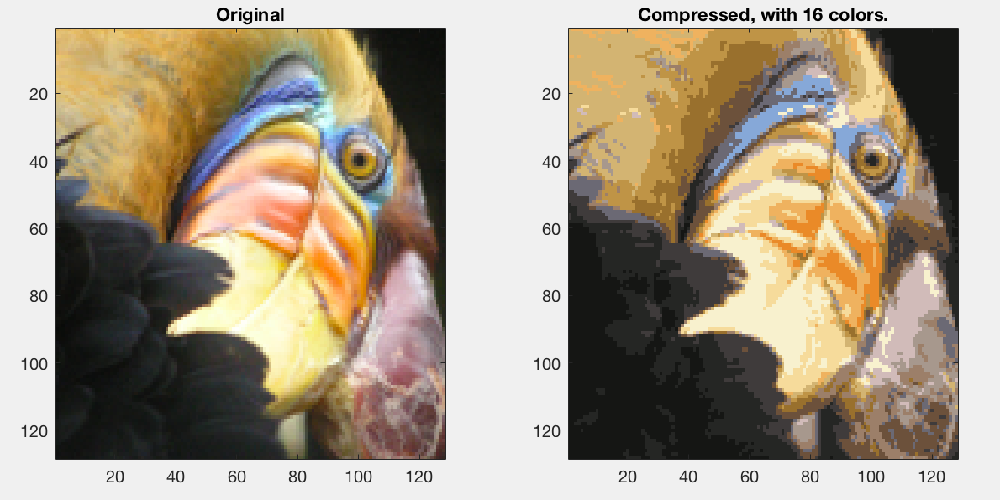
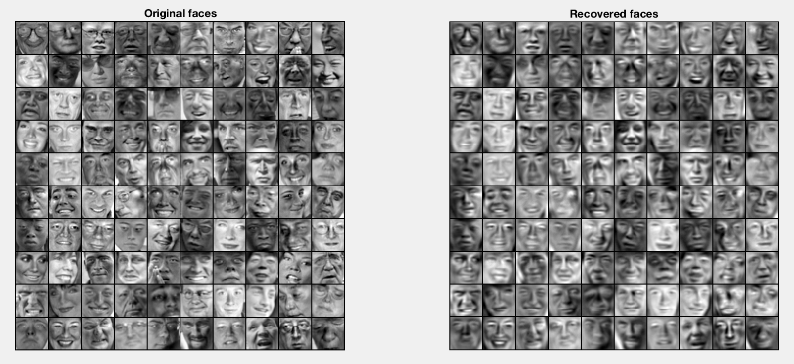

<h1 align="center">Dimensionality reduction
</h1>

These are two implementations of dimensionality reduction using K-means clustering and Principle Component Analysis (PCA). They were coded in Matlab as part of [Coursera's Machine Learning](https://www.coursera.org/learn/machine-learning) class. 

## Image compression

Here we use K-means clustering to transform a 24-bit color image to a 4-bit color image. The code can be run from [`code/ex7.m`](code/ex7.m). 

## Deconstructing and reconstructing faces

[`code/ex7_pca.m`](code/ex7_pca.m) computes the first 100 principle components of a set of faces and reconstructs the faces from this lower dimensional representation. 